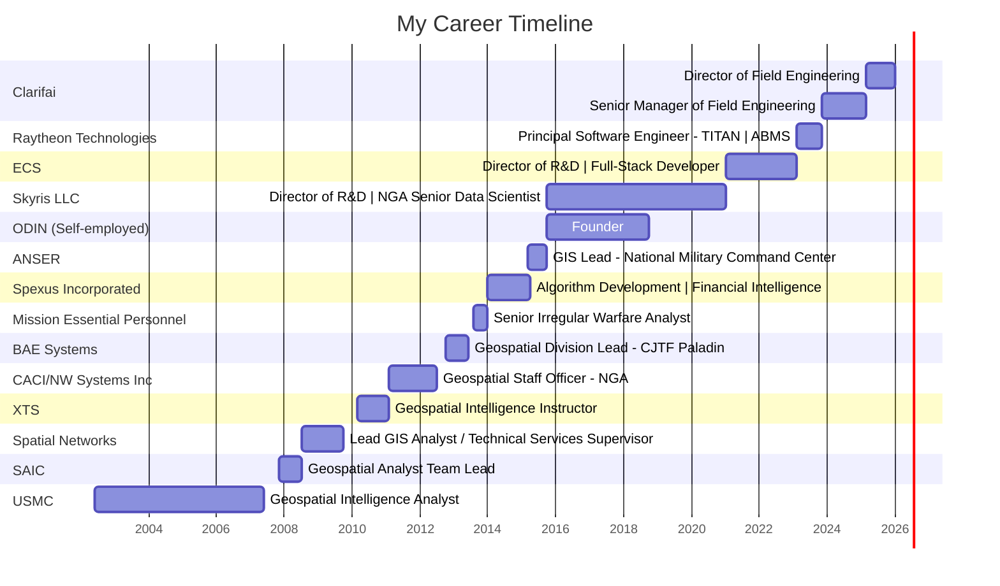

  <h1>👋 Hi, I'm Chris Mulder!</h1>
  
<em>Multitasking pro: code, coffee, chaos. 🚀 Passionate about AI, data extraction, and building innovative tools at Clarifai.</em>

   <strong>Connect with me:</strong>

  
  

  <h2>My Skills</h2>
  

    
    
    
    
    
    
    
    
    
    
    
    
    
    
    <!-- Expanded based on LinkedIn skills -->
  

